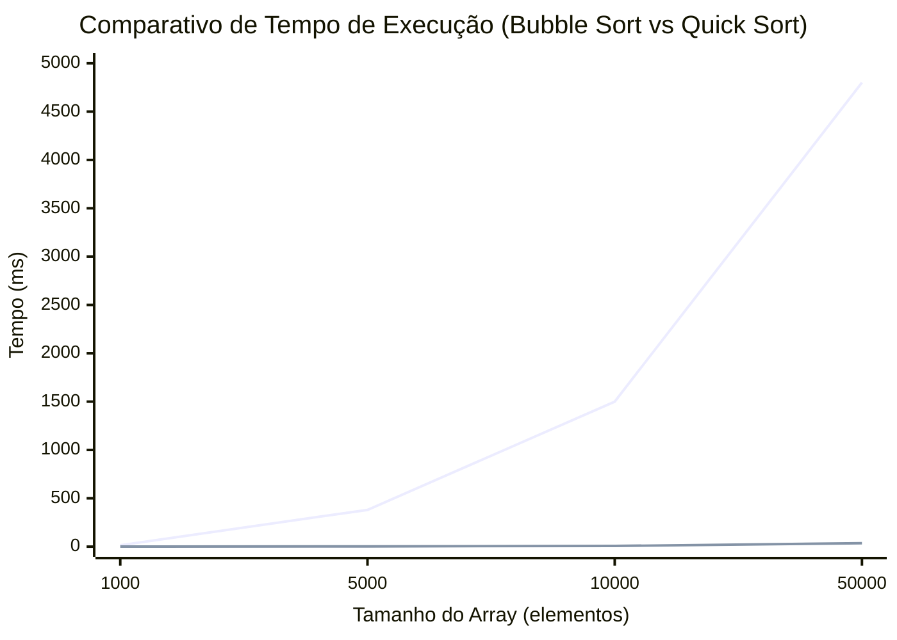

# ESTRUTURAS-DE-DADOS-Arrays-Matrizes-Algoritmos-de-Ordenação-e-Busca
Repositório desenvolvido para a disciplina de Estruturas de Dados do curso de Engenharia de Software no Centro Universitário UDF, com atividades práticas sobre arrays, matrizes, algoritmos de ordenação e algoritmos de busca.  Os exercícios foram desenvolvidos principalmente em Python, com foco na implementação dos algoritmos, análise de desempenho, quantidade de operações e complexidade computacional.
Este projeto apresenta um estudo sobre dois algoritmos fundamentais de ordenação: **Bubble Sort** e **Quick Sort**. O objetivo é analisar seus princípios de funcionamento, lógica de ordenação, complexidade computacional, utilização de memória, vantagens, limitações e principais aplicações.
explicação das diferenças entre Algoritmos de Ordenação Bubble Sort e Quick Sort  :

## 1. Bubble Sort

O **Bubble Sort** é um algoritmo de ordenação baseado na comparação sucessiva de elementos adjacentes. Durante cada passagem pelo vetor, os elementos são comparados e, caso estejam na ordem incorreta, são trocados. Dessa forma, os elementos de maior valor são gradualmente deslocados para o final da estrutura.

### Funcionamento

A lógica de comparação pode ser representada da seguinte forma:

```text
Se A[i] > A[i+1]:
    trocar A[i] com A[i+1]
```

O processo é repetido até que uma passagem completa seja realizada sem nenhuma troca. Nesse momento, considera-se que o vetor está ordenado.

### Complexidade

| Situação       | Complexidade |
| -------------- | -----------: |
| Melhor caso    |         O(n) |
| Caso médio     |        O(n²) |
| Pior caso      |        O(n²) |
| Uso de memória |         O(1) |

O melhor caso ocorre quando o vetor já está ordenado e o algoritmo utiliza uma condição de parada para identificar que nenhuma troca foi necessária.

### Vantagens

* Simplicidade conceitual;
* Facilidade de implementação;
* Baixo consumo de memória adicional;
* Estabilidade na ordenação.

### Limitações

* Baixa eficiência para grandes volumes de dados;
* Complexidade O(n²) no caso médio e no pior caso;
* Grande quantidade de comparações e trocas.

### Aplicações

O Bubble Sort é mais adequado para fins didáticos, listas pequenas ou conjuntos de dados que estejam próximos da ordenação. Não é recomendado para aplicações que trabalham com grandes volumes de dados e necessitam de alto desempenho.

---

## 2. Quick Sort

O método **Quick Sort** utiliza a estratégia de **Divisão** e **Conquista** para ordenar dados. O processo se baseia na escolha de um elemento de referência (o pivô) para particionar o array, alocando os valores menores de um lado e os maiores do outro. Essa mesma lógica é então executada de forma recursiva nas sublistas geradas.

### Funcionamento

O processo pode ser dividido em três etapas principais:

1. Seleção de um elemento como pivô;
2. Particionamento do vetor em relação ao pivô;
3. Aplicação recursiva do processo às sublistas resultantes.

### Complexidade

| Situação       |           Complexidade |
| -------------- | ---------------------: |
| Melhor caso    |             O(n log n) |
| Caso médio     |             O(n log n) |
| Pior caso      |                  O(n²) |
| Uso de memória | O(log n) no caso médio |

O melhor caso ocorre quando o pivô consegue dividir o vetor em partes aproximadamente iguais. O pior caso ocorre quando o pivô escolhido é repetidamente o menor ou o maior elemento, produzindo divisões muito desiguais.

### Vantagens

* Alto desempenho na prática;
* Complexidade média O(n log n);
* Adequado para grandes volumes de dados;
* Pode ser implementado de forma *in-place*, reduzindo a necessidade de memória auxiliar.

### Limitações

* A implementação tradicional não é estável;
* Seu desempenho depende da estratégia utilizada para escolha do pivô;
* Uma escolha inadequada do pivô pode resultar em complexidade O(n²).

### Aplicações

O Quick Sort é indicado para grandes conjuntos de dados e aplicações que necessitam de eficiência na ordenação. Entretanto, não é a melhor alternativa quando é necessário preservar a ordem relativa entre elementos de mesmo valor.

### exemplo em gráfico feito com ajuda de I.A para melhor entendimento



---

## 3. Comparação entre Bubble Sort e Quick Sort

| Característica             | Bubble Sort                                | Quick Sort                                                  |
| -------------------------- | ------------------------------------------ | ----------------------------------------------------------- |
| Princípio de funcionamento | Comparação e troca de elementos adjacentes | Divisão e conquista utilizando um pivô                      |
| Melhor caso                | O(n)                                       | O(n log n)                                                  |
| Caso médio                 | O(n²)                                      | O(n log n)                                                  |
| Pior caso                  | O(n²)                                      | O(n²)                                                       |
| Uso de memória             | O(1)                                       | O(log n) no caso médio                                      |
| Vantagem principal         | Simplicidade e facilidade de implementação | Eficiência e bom desempenho prático                         |
| Limitação principal        | Baixo desempenho em grandes volumes        | Sensibilidade à escolha do pivô                             |
| Aplicação recomendada      | Fins didáticos e listas pequenas           | Grandes volumes de dados e aplicações que exigem desempenho |

---

##  Análise e Conclusão (ETAPA FINAL DO TRABALHO)

As etapas desse projeto e os experimentos/códigos realizados permitem observar o comportamento dos algoritmos Bubble Sort e Quick Sort à medida que o tamanho da estrutura de dados aumenta.

###  Influência do tamanho da estrutura de dados

O aumento da quantidade de elementos influencia diretamente o número de operações realizadas pelos algoritmos. Quanto maior o vetor, maior tende a ser a quantidade de comparações e movimentações necessárias para concluir a ordenação. Esse aumento é especialmente significativo em algoritmos com complexidade quadrática, como o Bubble Sort.

###  Comparação do crescimento dos algoritmos

Bubble Sort e Quick Sort não apresentam o mesmo comportamento conforme o número de elementos aumenta. O Bubble Sort possui complexidade O(n²) no caso médio e no pior caso, fazendo com que o número de operações cresça rapidamente conforme o tamanho da entrada aumenta.

O Quick Sort apresenta complexidade média O(n log n), proporcionando um crescimento significativamente menor no número de operações na maioria dos casos. Entretanto, seu pior caso pode atingir O(n²), dependendo da estratégia utilizada para escolha do pivô.

Dessa forma, os códigos demonstram que o Quick Sort tende a apresentar melhor desempenho em estruturas maiores, enquanto o Bubble Sort pode ser adequado principalmente para estruturas pequenas e situações.

###  Importância da análise das operações

Analisar somente o resultado final da ordenação não é suficiente para comparar algoritmos, pois diferentes algoritmos podem produzir exatamente o mesmo resultado utilizando quantidades muito diferentes de operações.

A análise de comparações, trocas, movimentações e tempo de execução permite compreender a eficiência do algoritmo e como seu desempenho se comporta com o aumento da quantidade de dados. Portanto, além de verificar se a ordenação foi realizada corretamente, é necessário avaliar os recursos utilizados para alcançar o resultado.

### Conclusão Geral

A partir dos experimentos, conclui-se que o tamanho da estrutura de dados possui influência significativa no desempenho dos algoritmos de ordenação. O Bubble Sort apresenta crescimento quadrático no número de operações, enquanto o Quick Sort apresenta, em condições médias, crescimento de O(n log n).

Consequentemente, à medida que a quantidade de elementos aumenta, a diferença de desempenho entre os algoritmos tende a se tornar mais evidente. A análise experimental, juntamente com a análise de complexidade, permite compreender não apenas se um algoritmo funciona corretamente, mas também sua eficiência e adequação para diferentes volumes de dados.


